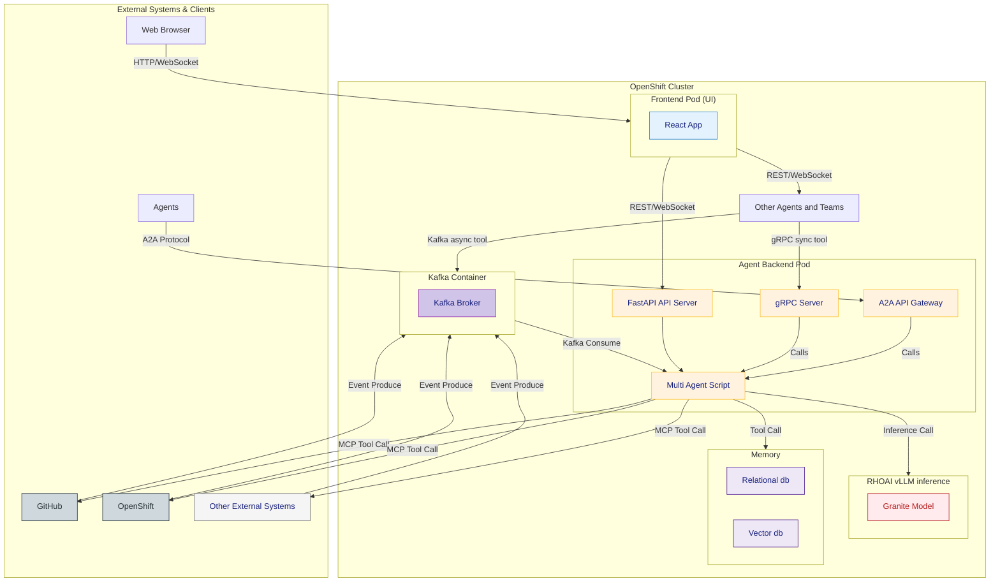

# System Architecture

This document provides a high-level overview of the system architecture for the Cloud Native Agents platform. The architecture consists of several core components, including the frontend UI, backend services, agent orchestration, messaging infrastructure, memory stores, and integrations with external systems. The deployment is designed to run on an OpenShift cluster, leveraging containerized services and scalable infrastructure.

Below is a visual representation of the architecture:

---

## What’s Missing from the Diagram?

While the above diagram provides a high-level overview of the system architecture, several important aspects are not depicted for clarity and simplicity:

1. **Internal Workings of the Multi Agent Script**
   - The diagram does not show the framework used to implement the multi-agent system, how agents are teamed together to solve a problem, or the orchestration logic.
   - Details on how agent memories are stored, retrieved, and shared are omitted.
   - The allocation and management of tools to agents, as well as the protocols for tool invocation, are not visualized.

2. **Observability and Service Mesh Sidecars**
   - Components such as logging, metrics, distributed tracing, and service mesh sidecars (e.g., Istio, Linkerd) are not shown.
   - These are critical for monitoring, debugging, and securing inter-service communication.

3. **Authentication and Security**
   - The diagram does not illustrate authentication flows, authorization checks, or security boundaries.
   - Mechanisms for securing APIs, gRPC, WebSocket, and Kafka communications are not depicted.

4. **Storage and Backup**
   - Persistent storage solutions, backup strategies, and disaster recovery mechanisms are not included.
   - Details about how data is backed up, restored, or migrated are omitted.

5. **Operator and Custom Resource Definitions (CRDs)**
   - The role of Kubernetes/OpenShift Operators and CRDs in managing the lifecycle of agents, models, and other resources is not visualized.
   - Automation and reconciliation logic provided by operators is not shown.

These aspects are essential for a production-grade deployment and will be considered in a more detailed architecture or operational documentation. 
